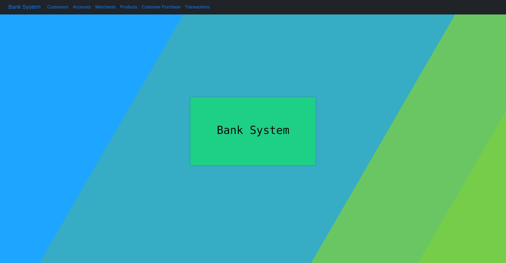
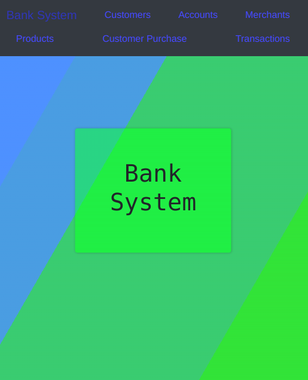
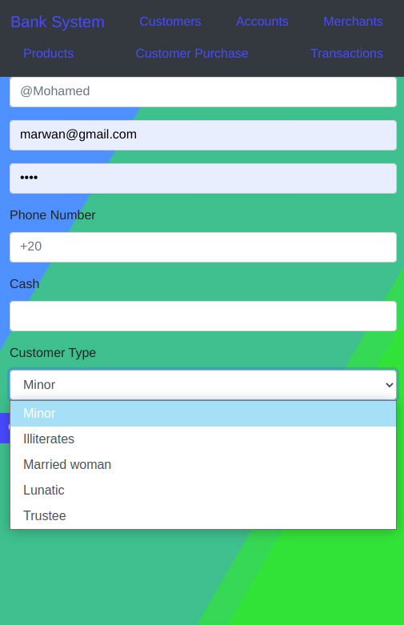
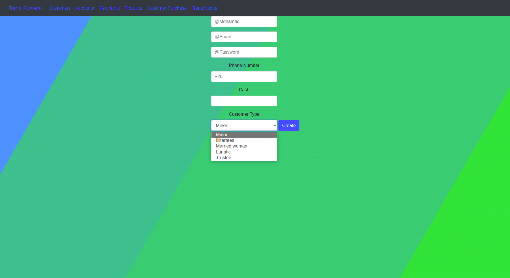
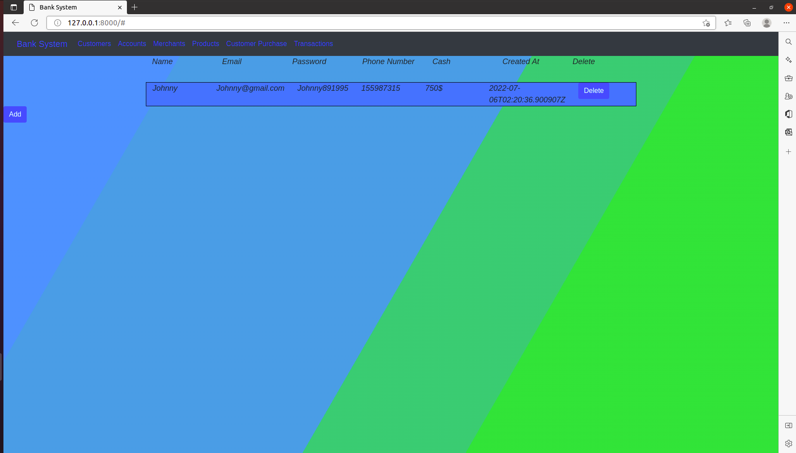
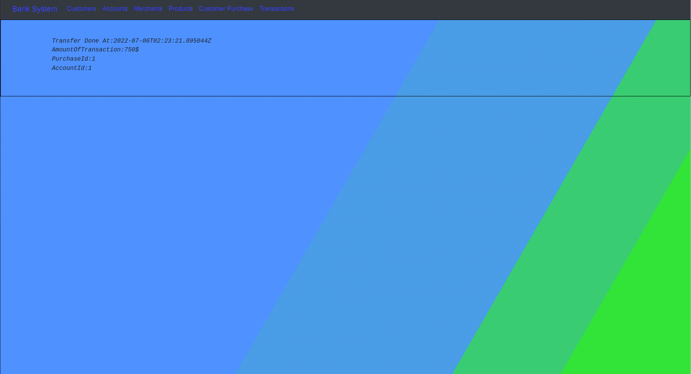

# 
# BankSystyem-Django-DRF
<table>
<tr>
<td>
  A BankSystem using Django, django rest framework to simulate real operation bank with merchants and customers
</td>
</tr>
</table>

## Table of contents
* [Demo](#demo)
* [Description](#description)
* [Installation and Running](#installation-and-running)
* [Usage](#usage)
* [Project files](#Project-files)
* [Built with](#built-with)


## Demo

[View demo on youtube](https://youtu.be/2_yCkQzs8SY)


## Description

My website called BankSystem which allows customers and merchnats to handle with eachother for purchases. This project is for purchases, customers and merchants only and has Some additional features to facilitate the purchase process between customers and merchants like(adding the name of any new product and dirctly transforming the money from account of customer to merchant when buy a product ), this project made by using django and django rest framework as a backend and JavaScript, HTML and CSS as a frontend programming languages also bootstrap as frontend library. all of the inforamtion are stored in a database (SQLite by default).

The project consists of two apps:
- one for backend (models, views, api)
- the second for frontend (html, css, javascript)

My website is mobile responsive.

 



## Installation and Running

- install requirments.txt in your virtual environment (version of Django, Django Rest Framework) 
`pip install -r requirments.txt`

- Cake and apply the migrations by running

    ``` bash
    python manage.py makemigrations

    python manage.py migrate
    ``` 
    
- Run the server

    ```bash
    python manage.py runserver
    ```
- Finally, goto the website on 127.0.0.1:8000

> Hint: I made migrations for models and inserted some data like customer Types and account Types which are constants for all bank systems


## Usage

* Firstly employees should create a new customer in the system by (name, email, password, phone number, Minimum amount of money to open a new account 1500$, customer type in bank system)

* Secondly create a new account by (account type, customer from customers 'who already exist in system')
* Thirdly add new merchant by (name, email, phone number)
* Fourthly adding a new product by (product name, merchant from merchants 'who already exist in system')
* Fifthly, now employees can make purchases for customers and add this by (the price of product, customer, product) and the cash of customer will transfer from customer to merchant through the bank

* When an employee creates a new customer and opens a new account for him, the customer can purchase from existing merchants and products.

* Directly when employee make a new customer purchase then the cash of the customer will decrease and send to the merchant

* All transactions will save on Transactions side for the system 

> Hint: if the employee didn't open an account for the customer then the customer couldn't deal with merchants or buy any products
and customer cant make buying process if his cach less than the price of product 


## Project files
```
.
├── bank                               	# Folder of backend
│   ├── migrations                     	# Migrations of database that i did to insertion constant data of bank system like (accounts types)
│   │   ├── 0001_initial.py
│   │   ├── __init__.py
│   │   └── __pycache__
│   │       ├── 0001_initial.cpython-38.pyc
│   │       └── __init__.cpython-38.pyc
│   ├── models.py                   		# The single, definitive source of information about the data. It contains the essential fields and behaviors of the data which storing.
│   ├── serializers.py				# Serializers file responsible for converting objects into data types understandable by javascript and front-end frameworks.
│   ├── urls.py				# Contains paths to functions in views file to handle with models
│   └── views.py				# Has functions which make change on database ( GET or POST or DELETE or PUT(update) ) which made by api DRF(django rest framework)
├── core					# The head of project which contains all apps and urls to them
│   ├── settings.py
│   └── urls.py
└── front					# Folder for frontend
    ├── static
    │   └── front
    │       ├── dynamic.js			# For dynamic view and make buttons and some of functions to handle clicks in the page
    │       └── styles.css			# Contain to styles.css file to make style of page and moving background
    ├── templates
    │   └── front
    │       ├── index.html			# In which forms that appear in page and be controlled by dynamic.js file
    │       └── layout.html			# Basics of index.html to improve or reduce or not to repeat code when creation a lot of pages.html
    ├── urls.py				# Path to one function (index)
    └── views.py				# Contain one function to return html files
```    
> Note: Two apps (backend and frontend) in one project run in one server http://127.0.0.1:8000/   
> To handle with api: ---> (http://127.0.0.1:8000/api/........) in empty space you can put (customer, account, merchant, product, etc...) 


## Built with 

- [js - HTML - CSS]
- [Django - DRF]
- [Bootstrap](http://getbootstrap.com/)
- [ER diagram] - Models of database creation was built with it.


